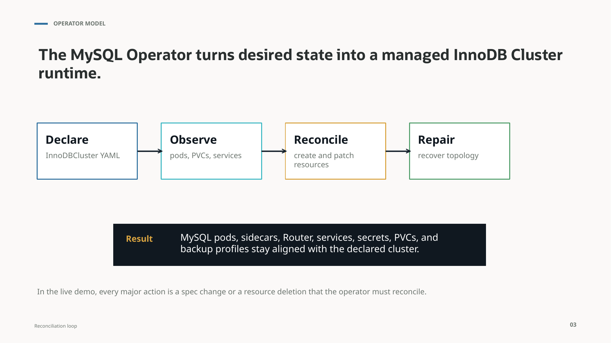
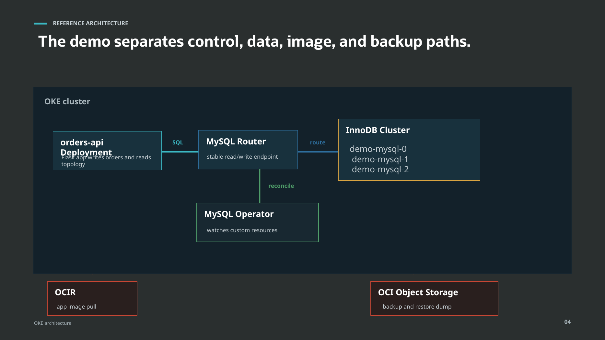
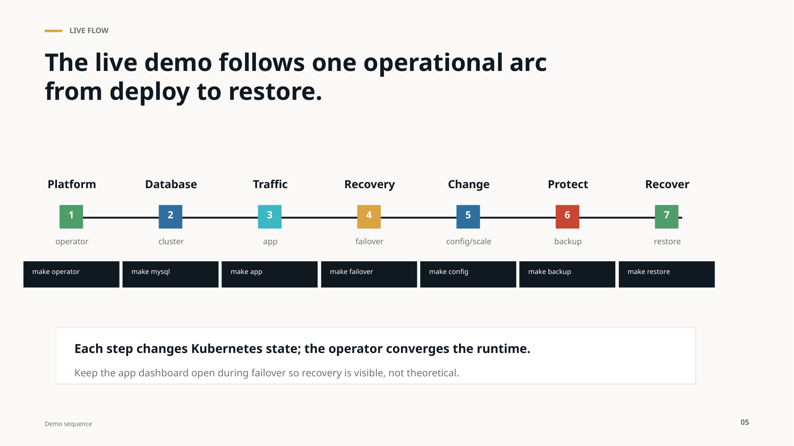

# MySQL on OKE: Database Operations as Kubernetes State

MySQL is one of the databases developers trust most when an application needs a proven, familiar, open source relational engine. Kubernetes has become the orchestration layer teams rely on to run and scale modern workloads. Put them together, and the question gets interesting: how do you run MySQL with the same declarative, repeatable operating model that Kubernetes brings to applications?

Running MySQL on Kubernetes starts with deployment, but the real value shows up when the full operational loop is repeatable. Teams need a consistent way to route application traffic, recover from failure, change configuration, protect data with backups, and prove that a restore actually works. Those Day 2 operations are what turn a database deployment into a reliable operating model.

Kubernetes makes MySQL operations even better when the lifecycle around the database becomes declarative and repeatable. The MySQL Operator for Kubernetes lets teams express the desired state of a MySQL InnoDB Cluster through Kubernetes resources instead of coordinating manual steps, scripts, and runbooks.

On Oracle Kubernetes Engine (OKE), that model becomes especially practical because the database runtime, application runtime, image registry, and backup target can all be wired into a cloud-native workflow.

Demo repository: [k-jaw/mysql-kubernetes](https://github.com/k-jaw/mysql-kubernetes)

## The Operational Problem

A useful MySQL demo has to prove more than provisioning. It has to prove the operational loop:

- Deploy a replicated MySQL runtime.
- Route application traffic through a stable endpoint.
- Recover when the writable primary disappears.
- Apply configuration changes in a repeatable way.
- Back up the database to durable storage.
- Restore into a new cluster from the backup artifact.

If the demo stops when the first MySQL pod becomes ready, it has only shown installation. Real operations begin after that.

The practical question is: how do you keep the database runtime aligned with the state you intended to run?

Manual operations drift. A command run during setup might be forgotten later. A one-off repair can fix an incident without updating the underlying runbook. A backup may exist, but a restore might not have been proven. Declarative operations give the platform something concrete to converge on.

## The Operator Model

The MySQL Operator turns desired state into a managed InnoDB Cluster runtime.



The main object is an `InnoDBCluster` custom resource. That resource describes the intended database shape: how many MySQL instances should exist, how Router should be deployed, which credentials and secrets are used, how storage is attached, how backups are configured, and what MySQL configuration should be applied.

From there, the operator follows the standard Kubernetes controller pattern:

1. Declare the intended state in YAML.
2. Observe the actual state of pods, services, PVCs, secrets, and related resources.
3. Reconcile differences by creating, patching, or repairing resources.
4. Help the database topology return to health after failures.

The important distinction is that the operator is not just a script that runs once. It keeps watching. It compares the declared cluster with the actual cluster and works to bring the runtime back in line.

For MySQL, that means pods, sidecars, Router, services, secrets, persistent volume claims, and backup profiles stay connected to the declared cluster shape. The database still requires database knowledge, but the repeatable operational mechanics become Kubernetes-native.

## Reference Architecture on OKE

The demo architecture separates four paths: application data, operator control, image delivery, and backup/restore.



Inside the OKE cluster, a small `orders-api` application generates visible read and write activity. The application is intentionally simple: its job is to write orders and expose enough topology information to make database behavior observable during operations.

The application does not connect directly to a specific MySQL pod such as `demo-mysql-0`. That would leak database topology into the application. Instead, it connects through MySQL Router, which gives the application a stable read/write endpoint while the underlying InnoDB Cluster handles primary and replica roles.

Behind Router is the InnoDB Cluster itself:

- `demo-mysql-0`
- `demo-mysql-1`
- `demo-mysql-2`

These MySQL instances use persistent volumes and participate in the replicated topology.

The MySQL Operator watches the Kubernetes custom resources and reconciles the runtime. When an `InnoDBCluster` or `MySQLBackup` resource changes, the operator turns that declared state into actual Kubernetes objects and MySQL lifecycle actions.

Outside the cluster, two OCI services matter:

- OCIR stores the application image that OKE nodes pull.
- OCI Object Storage stores backup dumps and provides the source for restore.

That separation matters. The application path flows through Router. The control path flows through Kubernetes resources and the operator. The image path flows through OCIR. The protection path flows through Object Storage. The result is not a single magic box; it is a normal cloud architecture where MySQL operations are represented as Kubernetes state.

## A Day 2 Demo Flow

A practical demo can be organized as one operational arc from deploy to restore.



The exact automation can vary, but the flow looks like this:

```bash
make prereqs
make operator
make mysql
make app
make failover
make config
make backup
make restore
```

`make prereqs` validates local tools, container runtime access, OCI configuration, and Kubernetes access.

`make operator` installs or verifies the MySQL Operator in the `mysql-operator` namespace. This gives the cluster the controller that understands MySQL custom resources.

`make mysql` submits the `InnoDBCluster` resource, related secrets, storage configuration, and backup configuration. A wait step then confirms that MySQL pods and Router become ready.

`make app` builds and deploys the demo application. The application gives the audience something better than static terminal output: live read and write behavior against the database.

`make failover` identifies the current writable primary and deletes that pod. Kubernetes replaces the pod, InnoDB Cluster elects or reports a writable primary, and the operator helps the runtime converge back toward health.

`make config` patches declared MySQL configuration. The point is not that configuration can change; of course it can. The point is that the change is expressed through the cluster specification rather than by manually editing files inside pods.

`make backup` creates a `MySQLBackup` resource and waits for it to complete. The backup lands in OCI Object Storage.

`make restore` creates a separate MySQL cluster initialized from the backup dump. This is the stronger proof: not only did a backup complete, but the backup can be used to bring up another operator-managed cluster.

Each step changes Kubernetes state. The operator converges the runtime.

## What to Watch During the Demo

The value of the operator becomes visible when the demo is judged by resource state and application behavior together.

### Declared State

One `InnoDBCluster` should produce the expected runtime: MySQL pods, services, PVCs, Router, secrets, and backup configuration.

Useful checks include:

```bash
kubectl get innodbcluster
kubectl get pods,svc,pvc
```

The evidence is not just that Kubernetes has pods. The evidence is that the objects match the declared database shape.

### Topology Recovery

A failover test should start by identifying the current writable primary. Then the demo deletes that primary pod and watches the system recover.

```bash
make primary
make failover
make primary
```

This is where database operations become more than container operations. Replacing a pod is necessary, but it is not sufficient. The database topology also has to return to a healthy state with a writable primary.

### Backup and Restore Proof

A backup is only half the story. A restore proves that the backup artifact can initialize a new runtime.

```bash
make backup
make restore
```

The backup should write a MySQL Shell dump to OCI Object Storage. The restore should create a separate cluster, often with a name such as `demo-mysql-restore`, initialized from that dump prefix.

That turns protection from a side workflow into an observable Kubernetes operation.

## What Changes With the MySQL Operator

The operator does not make database operations disappear. It changes how they are packaged, repeated, observed, and repaired.

Without an operator, provisioning often depends on manual shape and scripts. With the MySQL Operator, provisioning becomes an `InnoDBCluster` declaration.

Without an operator, routing can become a hand-managed set of endpoints. With the operator, MySQL Router is reconciled as part of the desired cluster state.

Without an operator, recovery may depend on a human-driven repair path. With the operator, Kubernetes pod replacement and InnoDB Cluster topology convergence work together to return the runtime to health.

Without an operator, backup might be a separate workflow outside the database runtime definition. With the operator, Object Storage backup profiles and `MySQLBackup` resources make backup and restore part of the same operational model.

## The Takeaway

The database is still MySQL. The operating model is Kubernetes-native.

For teams already using Kubernetes as their application platform, that is the practical value of the MySQL Operator on OKE. Database lifecycle operations can be declared, watched, repeated, and audited through the same platform API used for the rest of the application stack.

Kubernetes becomes the operational API for MySQL lifecycle, resilience, backup, and restore.

That does not remove the need to understand MySQL. It removes the need to encode every routine operational task as a fragile sequence of manual actions. The operator gives the platform something to converge on, and it gives operators a clearer way to prove that the database runtime is doing what they declared.
